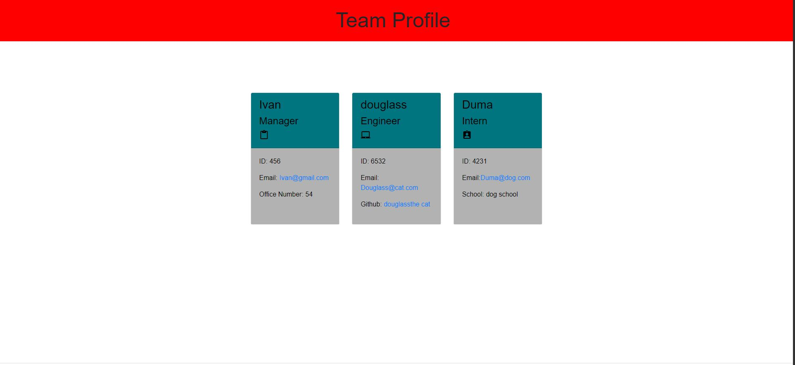

# Team Profile generator
undefined
  
## Description
    We were tasked to create a app that generates a webpage that displays your team and their basic info

## Table of Contents
* [Installation](#installation)
* [Usage](#usage)
* [License](#license)
* [Contributors](#contributors)
* [Tests](#tests)
* [Questions](#Questions)
*[GitHub](#GitHub)

## Installation
    Clone the repository from github and make sure you have Node downloaded. It also uses inquirer.

## Usage
<<<<<<< HEAD
    Just answer the questions on the terminal or use the watch the video

=======
    Just answer the questions on the terminal.
>>>>>>> 77cd05a8e9453681e70473335bee5e1da5e2be68

## License
   This application is covered under the [Unlicensed] license. 

## Contributors
    None

## Tests
   Use test on the terminal

## Questions
Please reach out to me with questions or comments. My GitHub user name is [undefined](https://github.com/ undefined). My email address is ivan.ramirez10208@gmail.com.
       

